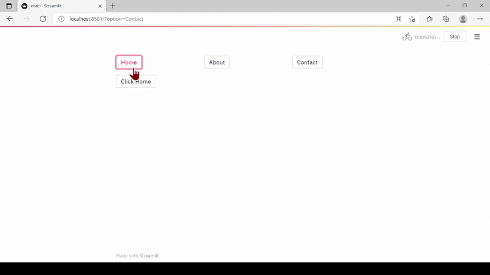

# streamlit_pages


## Installation

```bash
$ pip install streamlit-pages
```

## Features

- Adding multiple pages to [streamlit](https://streamlit.io/)
- Sharing specific pages


## Usage
```bash
 import streamlit as st
 import streamlit_pages.streamlit_pages import MultiPage
def home():
    st.write("Welcome to home page")
    if st.button("Click Home"):
        st.write("Welcome to home page")


def about():
    st.write("Welcome to about page")
    if st.button("Click about"):
        st.write("Welcome to About page")


def contact():
    st.write("Welcome to contact page")
    if st.button("Click Contact"):
        st.write("Welcome to contact page")


# call app class object
app = MultiPage()
# Add pages
app.add_page("Home",home)
app.add_page("About",about)
app.add_page("Contact",contact)
app.run()
```


## Contributors

We welcome and recognize all contributions. You can see a list of current contributors in the [contributors tab](https://github.com/bvenkatesh-ai/streamlit_pages/graphs/contributors).

### Credits
- Streamlit pages idea's inspirations was [upraneelnihar](https://github.com/upraneelnihar/streamlit-multiapps)
- Streamlit discussion forum inspired a lot in developing this one.  
- This package was created with Cookiecutter and the UBC-MDS/cookiecutter-ubc-mds project template, modified from the [pyOpenSci/cookiecutter-pyopensci](https://github.com/pyOpenSci/cookiecutter-pyopensci) project template and the [audreyr/cookiecutter-pypackage](https://github.com/audreyr/cookiecutter-pypackage).
